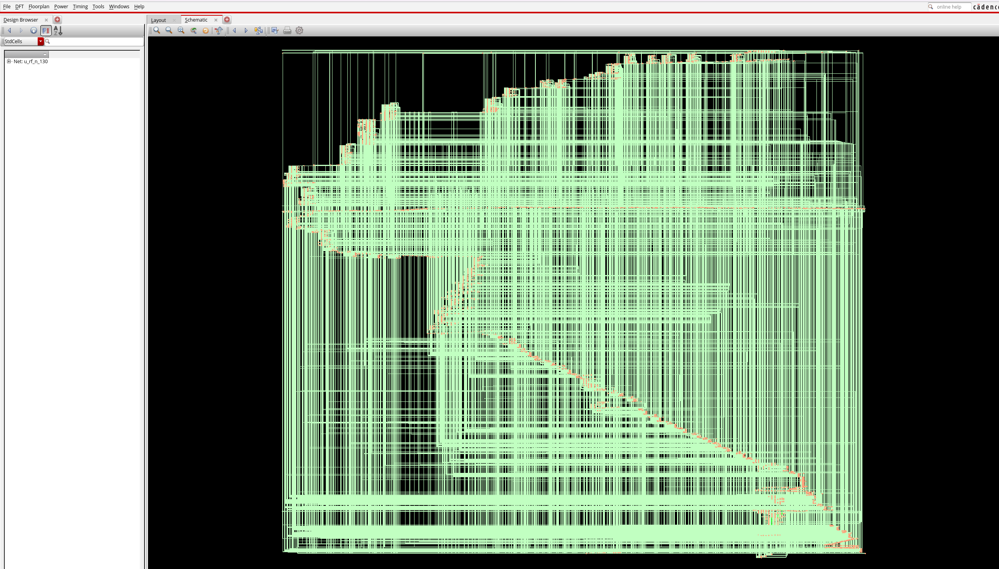
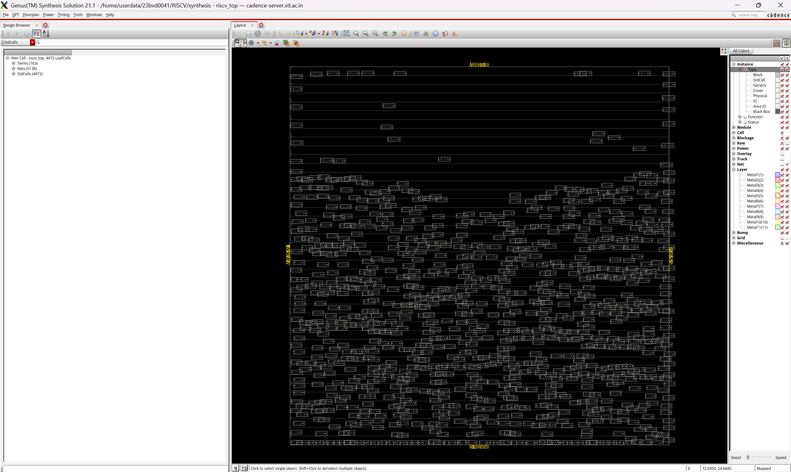

# RTL-to-GDSII Implementation of a Single-Cycle RV32I RISC-V Processor

*A complete ASIC implementation flow — from Verilog RTL to GDSII layout.*

</div>

---

## Overview

This repository documents the end-to-end implementation of a **32-bit single-cycle RV32I RISC-V processor** through the ASIC design flow — starting with RTL design and logic synthesis, and progressing through logical equivalence checking, physical design, timing signoff, and final GDSII generation.

## Implementation Flow

| Stage | Tool | Status |
|---|---|:---:|
| RTL Design | Verilog HDL | Complete |
| Logic Synthesis | Cadence Genus | Complete |
| Physical Layout Estimation (PLE) | Cadence Genus | Complete |
| Logical Equivalence Check (LEC) | Cadence Conformal | Complete |
| Physical Design | Cadence Innovus | Planned |
| Timing Signoff | Cadence Tempus | Planned |
| GDSII Generation | Cadence Innovus | Planned |

---

## Stage 1 — Logic Synthesis

### Overview

The first stage of the ASIC implementation flow converts the synthesizable RTL into a technology-mapped gate-level netlist using **Cadence Genus**. During this stage, the design is optimized to satisfy timing constraints while minimizing area and power, using a **wireload-model (timing library)** area mode.

The synthesis flow includes:

- RTL elaboration
- Library linking
- Multi-Mode Multi-Corner (MMMC) setup
- Timing constraint application
- Logic optimization
- Technology mapping
- Automatic clock gating
- Gate-level netlist generation
- Report generation

### Implementation Environment

| Parameter | Value |
|---|---|
| Synthesis Tool | Cadence Genus 21.14 |
| Technology Library | Generic 45 nm Standard Cell Library |
| Timing Constraints | Synopsys Design Constraints (SDC) |
| Timing Analysis | Multi-Mode Multi-Corner (MMMC) |
| Design | Single-Cycle RV32I RISC-V Processor |

### Synthesis Files

| File | Description |
|---|---|
| [`genus_script.tcl`](./Synthesis/genus_script.tcl) | Main logic-synthesis script: reads RTL sources, loads technology libraries and MMMC configuration, applies timing constraints, runs synthesis and optimization, inserts clock gating, generates the synthesized netlist, and exports reports. |
| [`genus_ple_script.tcl`](./Synthesis/genus_ple_script.tcl) | Physical Layout Estimation script — synthesizes with **spatial interconnect mode** and **physical-library area mode** instead of a generic wireload model, giving area, timing, and power estimates that account for placement-aware wire parasitics. |
| [`riscv_lec.do`](./Synthesis/riscv_lec.do) | Cadence Conformal do-file that runs a **Logical Equivalence Check (LEC)** between the golden RTL-mapped netlist and the synthesized (revised) gate-level netlist. |
| [`constraints.sdc`](./Synthesis/constraints.sdc) | Design timing constraints — clock definition and period, input/output delay, driving cell, output loading, and clock uncertainty. Shared by both synthesis flows. |
| [`mmmc.tcl`](./Synthesis/mmmc.tcl) | Multi-Mode Multi-Corner analysis environment — library sets, RC corners, delay corners, constraint modes, and analysis views. |

### Design Summary

| Metric | Result |
|---|---:|
| Leaf Cell Count | **4,892** |
| Sequential Cells | **1,055** |
| Combinational Cells | **3,837** |
| Cell Area | **13,331.160 µm²** |

> **Observation:** The synthesized processor maps to fewer than 5,000 standard cells while maintaining a compact silicon area. The majority of the logic consists of combinational circuitry, with sequential elements primarily coming from the register file and processor state.

### Timing Analysis

| Metric | Result |
|---|---:|
| Total Negative Slack | **0 ns** |
| Violating Paths | **0** |
| Worst Slack (COMBO group) | **1,889.5 ps** |

> **Observation:** The design successfully meets all specified timing constraints. Zero violating paths and positive slack across every cost group indicate that the processor is capable of operating at the target frequency without setup timing violations.

### Power Analysis

| Component | Result |
|---|---:|
| Leakage Power | **638.346 nW** |
| Dynamic Power | **84.462 µW** |
| Total Power | **85.100 µW** |

> **Observation:** Leakage power is extremely low, while dynamic power dominates overall consumption — expected for a synchronous processor. Automatic optimization and clock gating help reduce unnecessary switching activity.

### Clock Gating

| Metric | Result |
|---|---:|
| Clock Gating Cells | **31** |
| Total Flip-Flops | **1,024** |
| Clock-Gated Flip-Flops | **992 (96.88%)** |
| Ungated Flip-Flops | **32 (3.12%)** |
| Estimated Toggle Saving | **99.87%** |

> **Observation:** Cadence Genus successfully inserted clock-gating cells, gating nearly all sequential elements. This significantly reduces dynamic power without affecting functionality. The remaining ungated flip-flops correspond primarily to always-active registers such as the program counter.

---

## Stage 1b — Physical Layout Estimation (PLE)

### Overview

This stage re-runs synthesis in **PLE (Physical Layout Estimation) mode**, using a **spatial interconnect mode** and **physical-library area mode** instead of a generic wireload model. Genus estimates placement, physical cell area, and a floorplan utilization figure, giving a much closer preview of what the design will look like after physical design in Innovus.

### Design Summary

| Metric | Result |
|---|---:|
| Leaf Cell Count | **4,768** |
| Sequential Cells | **1,055** |
| Combinational Cells | **3,713** |
| Cell Area | **3,245.751 µm²** |
| Net Area | **836.675 µm²** |
| Total Area (Cell + Net) | **4,082.426 µm²** |
| Floorplan Utilization | **62.42%** |

### Timing Analysis

| Metric | Result |
|---|---:|
| Total Negative Slack | **0 ns** |
| Violating Paths | **0** |
| Worst Slack (COMBO group) | **1,918.6 ps** |

### Power Analysis

| Component | Result |
|---|---:|
| Leakage Power | **832.807 nW** |
| Internal Power | **81.911 µW** |
| Switching Power | **20.100 µW** |
| Total Power | **102.844 µW** |

### Clock Gating

| Metric | Result |
|---|---:|
| Clock Gating Cells | **31** |
| Total Flip-Flops | **1,024** |
| Clock-Gated Flip-Flops | **992 (96.88%)** |
| Ungated Flip-Flops | **32 (3.12%)** |
| Estimated Toggle Saving | **99.87%** |

> **Observation:** With explicit clock-gating insertion enabled in the PLE flow, gating results now match the logic-synthesis run exactly (992/1,024 flops gated). This closed most of the power gap seen in earlier iterations of this flow.

---

## Logical vs. Physical Synthesis — Comparison

| Metric | Logic Synthesis | Physical Layout Estimation (PLE) | Δ |
|---|---:|---:|---:|
| Leaf Cell Count | 4,892 | 4,768 | −124 |
| Sequential Cells | 1,055 | 1,055 | 0 |
| Combinational Cells | 3,837 | 3,713 | −124 |
| Cell Area | 13,331.160 µm² | 3,245.751 µm² | −10,085.4 µm²* |
| Net Area | 0.000 µm² (not modeled) | 836.675 µm² | +836.7 µm² |
| Total Area | 13,331.160 µm² | 4,082.426 µm² | −9,248.7 µm²* |
| Total Power | 85.100 µW | 102.844 µW | +17.7 µW |
| Clock Gating Cells | 31 | 31 | 0 |
| Clock-Gated Flip-Flops | 992 (96.88%) | 992 (96.88%) | 0 |
| Worst Slack (COMBO) | 1,889.5 ps | 1,918.6 ps | +29.1 ps |
| Timing Violations | 0 | 0 | — |

\* *Area is not directly comparable: the logic-synthesis run reports area against the generic timing library (wireload model, no net area), while the PLE run reports area against the physical library with spatial interconnect and explicit net area. The PLE numbers are the more realistic pre-placement estimate.*

> **Observation:** The two runs use different area/power models on purpose — logic synthesis targets timing closure against a generic wireload model, while PLE mode trades that generic model for placement-aware (spatial) parasitics and a physical-library area view. With clock gating enabled identically in both flows, the results now line up closely: gating results are an exact match (992/1,024 flops gated), and total power differs by only ~18 µW, mostly attributable to the added switching/internal power from spatial interconnect parasitics that aren't modeled in the generic wireload run. Both runs close timing cleanly with zero violations, and slack values track within ~30 ps of each other.

---

## Stage 1c — Logical Equivalence Check (LEC)

### Overview

To confirm that logic synthesis did not alter the functional behavior of the design, a **Logical Equivalence Check (LEC)** is run in **Cadence Conformal**, comparing:

- **Golden design:** the RTL-elaborated, pre-synthesis mapped netlist (`fv_map.v.gz`)
- **Revised design:** the synthesized gate-level netlist produced by Genus (`riscv_netlist.v`)

The [`riscv_lec.do`](./Synthesis/riscv_lec.do) script reads both designs, elaborates them under the `riscv_top` root, applies flattening rules for sequential constants, gated clocks, and D-latch/D-flip-flop conversions, then runs a full point-by-point comparison and reports any non-equivalent, aborted, or uncompared points.

### Results

| Metric | Golden | Revised |
|---|---:|---:|
| Primary Inputs (PI) | 66 | 66 |
| Primary Outputs (PO) | 97 | 97 |
| DFF/DLAT | 1,024 | 1,024 |
| Total Mapped Points | 1,187 | 1,187 |
| Unreachable (unmapped) DLAT | 31 | 31 |

| Compare Result | Count |
|---|---:|
| Compared Points | **1,121** |
| Equivalent Points | **1,121** |
| Non-Equivalent Points | **0** |
| Aborted Points | **0** |
| Not-Compared Points | **0** |
| **Overall Result** | **PASS** |

> **Observation:** All 1,121 compared points (97 primary outputs + 1,024 DFFs) are reported equivalent, with zero non-equivalent, aborted, or uncompared points. This confirms the Genus-synthesized gate-level netlist is functionally identical to the golden RTL-mapped netlist. Full detail is available in [`lec_result_1.png`](./Synthesis/Reports/lec_result_1.png), [`lec_result_2.png`](./Synthesis/Reports/lec_result_2.png), and [`lec_result_3.png`](./Synthesis/Reports/lec_result_3.png) in the repository.

---

## Quality of Results (QoR)

- Successful technology mapping (logic and physical-layout-estimation synthesis)
- Positive timing slack in both synthesis flows
- Zero timing violations in both synthesis flows
- Optimized standard-cell area
- Automatic clock-gating insertion in both flows, with matching gating coverage
- Logical equivalence verified between golden RTL netlist and synthesized netlist (Conformal LEC)
- Gate-level netlist generation ready for physical design

---

## Cadence Genus GUI

Screenshots from the Cadence Genus GUI showing the synthesized design, implementation statistics, and generated reports:

**Logic Synthesis**

<p align="center">
  
</p>

**Physical Layout Estimation (PLE)**

<p align="center">
  
</p>

---

## Next Stage

The next implementation milestone is **Physical Design** using Cadence Innovus, which will cover:

- Floorplanning
- Power Planning
- Placement
- Clock Tree Synthesis (CTS)
- Routing
- Physical Verification
- Post-route Optimization

Future updates to this repository will document each stage through final GDSII layout generation.

---

## Repository Structure

```
.
├── Synthesis/
│   ├── RTL/                        # Verilog RTL source files
│   │   ├── RISCV_top.v
│   │   ├── alu.v
│   │   ├── control_unit.v
│   │   ├── decoder.v
│   │   ├── program_counter.v
│   │   └── regfile.v
│   ├── genus_script.tcl            # Logic synthesis script
│   ├── genus_ple_script.tcl        # Physical Layout Estimation (PLE) script
│   ├── riscv_lec.do                # Conformal LEC script (golden vs. revised netlist)
│   ├── constraints.sdc             # Timing constraints (SDC)
│   ├── mmmc.tcl                    # MMMC analysis setup
│   └── Reports/
│       ├── gui_show.png            # Logic synthesis GUI screenshot
│       ├── gui_show_ple.png        # PLE GUI screenshot
│       ├── lec_result_1.png        # LEC — unmapped points / compare setup
│       ├── lec_result_2.png        # LEC — compare data summary
│       ├── lec_result_3.png        # LEC — final verification report
│       ├── report_area.rpt / report_area_ple.rpt
│       ├── report_power.rpt / report_power_ple.rpt
│       ├── report_clock_gating.rpt / report_clock_gating_ple.rpt
│       ├── report_qor.rpt / report_qor_ple.rpt
│       └── report_timing.rpt / report_timing_ple.rpt
└── README.md
```

## License

This project is licensed under the MIT License — see the [LICENSE](./LICENSE) file for details.
